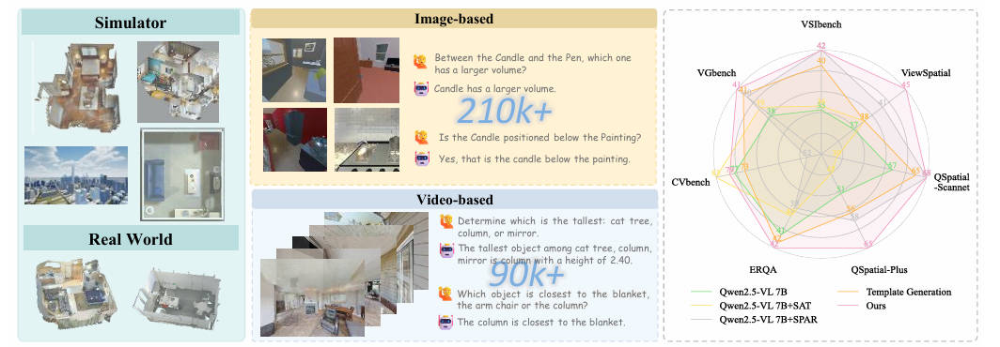
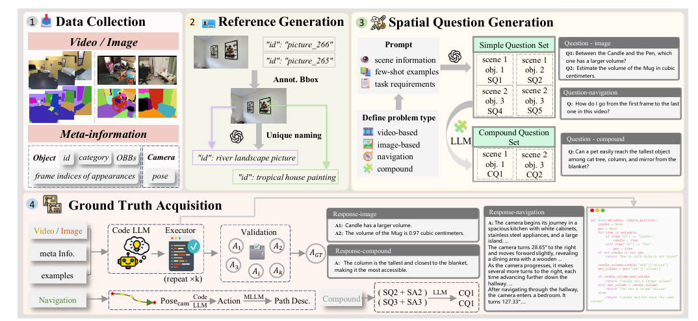
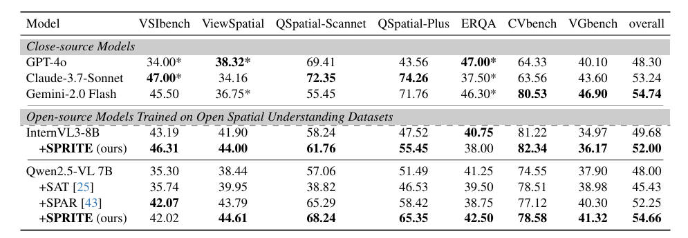
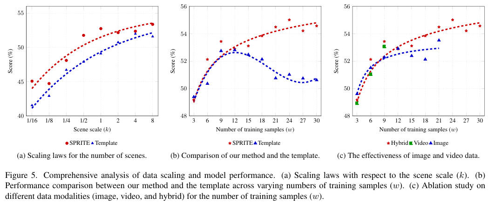
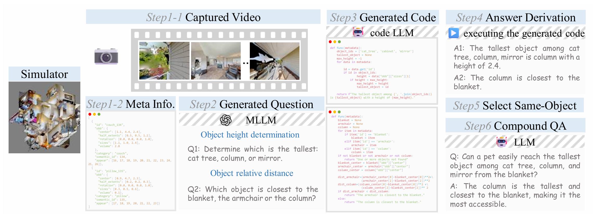

<h1 align="center">🔥 SPRITE 🔥</h1>

<p align="center">
  Scaling Spatial Reasoning in MLLMs through Programmatic Data Synthesis
</p>

<p align="center">
  <a href=敬请期待>
    
  </a>
  <a href=敬请期待>
    
  </a>
  <a href=敬请期待>
    
  </a>
</p>

# Scaling Spatial Reasoning in MLLMs through Programmatic Data Synthesis


## 🔗 Quick Links

- [Overview](#overview)
- [Highlights](#highlights)
- [Method](#Method)
- [Experiments](#Experiments)
- [Case studt](#casestudy)
- [Getting Started](#GettingStarted)
- [Citation](#Citation)


## 📝 TODO
- [ ] Release data generation code pipeline
- [ ] Open source dataset
- [ ] Open source model weight


## 🧠 Overview

Embodied intelligence, a grand challenge in artificial intelligence, is fundamentally constrained by the limited spatial understanding and reasoning capabilities of current models. Prevailing efforts to address this by enhancing Vision-Language Models (VLMs) are trapped in a dilemma: template-based datasets are scalable but structurally rigid, while manual annotation is linguistically diverse but unscalable and, critically, computationally imprecise. We introduce SPRITE, a novel framework that overcomes this dilemma by leveraging simulators and large models to programmatically synthesize scalable, diverse, and high-quality spatial reasoning data. The core innovation of SPRITE is to reframe ground-truth generation as a code-generation task. We utilize LLMs to compile complex spatial questions into executable programs, which are then verified against high-precision scene meta-information extracted from simulators. This ensures our ground truth is both computationally precise and verifiable, while the generative power of LLMs provides vast linguistic diversity. 
Leveraging this pipeline, we have curated a dataset encompassing $3$ simulators, $11k+$ scenes, and $300k+$ image/video instruction-tuning pairs. 
We demonstrate that a VLM trained on our data achieves significant performance gains on multiple spatial benchmarks and outperforms other open-source datasets of equivalent size. Furthermore, a scalability analysis confirms our hypothesis that overcoming the low-diversity nature of traditional template methods is essential for building robust, generalizable spatial intelligence.


## ✨ Highlights
- Programmatic Ground Truth: SPRITE innovatively transforms spatial reasoning ground-truth generation into an LLM-driven code-generation task, leveraging simulator data to ensure computational precision and verifiability at scale.
- High-Diversity Data: Synthesized $300k$ instruction pairs from $7k+$ videos and $30k+$ images, empirically proving that scene diversity is critical for building robust spatial intelligence.


## 🏗️ Method


Our framework, SPRITE, consists of four main stages to ensure diversity and precision:
1. Data Collection: We harvest rich multi-modal data (RGB, Depth, Semantic Seg) and meta-information (Object OBBs, Camera Pose) from simulators (Habitat, AI2-THOR, AirSim) and real-world datasets (ScanNet).
2. Reference Generation: To resolve object ambiguity (e.g., multiple "chairs"), we use GPT-4o to generate unique referring expressions for objects based on visual crops and bounding boxes.
3. Diverse Question Generation: We categorize spatial tasks into Video, Image, Navigation, and Compound questions. An LLM generates linguistically diverse questions based on scene metadata.
4. Ground Truth Acquisition:
    - Instead of manual labeling, we use a Code LLM (e.g., Qwen3-32B) to write Python scripts that query the scene metadata (e.g., calculate_distance(obj_A, obj_B)).
    - The code is executed to derive the exact answer, ensuring mathematical correctness.

## 🧪 Experiments



We fine-tuned Qwen2.5-VL-7B and InternVL3-8B on our SPRITE-300K dataset.
Comparison with State-of-the-Art
Our model outperforms open-source baselines and rivals proprietary models on multiple benchmarks.




We conducted a comprehensive analysis of data scaling (see Figure 5 in the paper):

- Scene Diversity: Performance shows a clear positive correlation with the number of unique scenes (up to 8k), confirming that scene diversity is critical for spatial reasoning.

- Robustness vs. Template Methods: Unlike template-based generation which saturates or degrades after 120k samples due to low diversity, SPRITE maintains consistent performance gains as data volume increases to 300k.

- Modality Synergy: Hybrid training (Image + Video) yields superior performance compared to single-modality training, demonstrating the value of our diverse data collection.


## 🧪 Case Study


## 🚀 Getting Started
```
SPRITE/
├── figs/
├── metadata/
│   ├── image/                    ### Single-image data example
│   ├── image_multi/              ### Multi-image data example
│   └── video/                    ### Video data example
└── src/
    ├── autocode_image/           ### Data generation approach
    ├── autocode_image_mul/       ### Generate multi-image Q&A pairs
    ├── autocode_video/           ### Generate video Q&A pairs
    ├── compound/                 ### Generate compound Q&A pairs
    ├── navigation/               ### Generate navigation Q&A pairs
    ├── reference/                ### Reference Generation
    └── vote/                     ### Voting verification
```
The specific code descriptions are in their respective directories

## 🖊️ Citation
coming soon
